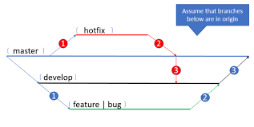

# 为什么使用 `Git`

首先先明确代码版本管理是非常重要的，`Git` 只是我们做版本管理的一个工具。

通过对代码进行版本管理，我们可以得到如下的好处。

- 通过对不同版本的比较，可以确切地知道自己对代码做了哪些变更
- 我们可以轻松回退到任意一个版本
- 仅仅使用一个 `id` 就可以准确表述代码所处的版本，沟通更高效
- 便捷地备份到不同的地方，比简单地复制更加可靠的备份
- 代码合并功能：极大地方方便多人协作开发、代码评审

## 为什么使用Git做版本管理？

- `Git` 非常流行，功能强大，开源世界的基础工具
- 分布式的特性，不依赖服务器工作
- 具有较好的性能

> 其他的类似工具还有：`CVS`,`SVN`(曾经的王者)。`Git` 直译过来是**饭桶**的意思，由 `Linux` 之父 `Linux Torvalds` 两周完成初始开发，一月之内 `Linux` 的庞大代码库就由 `Git` 进行管理了。（[引自廖雪峰](https://www.liaoxuefeng.com/wiki/896043488029600/896202815778784)）

## 考虑如下的场景

### 场景一

代码突然出问题了，想回退到2天前的写的代码，2天前还是好好的，这2天改了好多内容，那一直按 `ctrl + z` 可以退回去吗？
> 解决方案：`git checkout -b debug && git reset --hard 
[commit-id]`

### 场景二

A、B两个同学在开发同一个软件

- A同学：欸，B同学，你开发的xx功能不能使用啊!
- B同学：不可能啊，上周我测试过了，发给你的代码复制过去了吗？
- A同学：不记得了，我看看！啊啊啊，果然没复制。但是我也修改了这个文件，我直接把你的文件拷贝进去不就覆盖了我的修改了吗？难搞哦
- B同学：这。。。关我啥事

> 解决方案：`git merge [code-from-B]`

### 场景三

保存代码的机器坏掉了，因为是固态硬盘，数据基本不可能恢复了。虽然在自己的某个硬盘里有个备份，但是这个备份已经是1个月前的版本了。
> 解决方案：还好每次代码提交都推送到远程仓库了，`git clone [url-to-remote-repository]`

### 场景四

如何配合 `pipenv` 对 `Python` 虚拟环境进行版本管理？[Pipenv简明教程](../Python/Pipenv简明教程.md)

> 解决方案：对 `Pipfile` 和 `Pipfile.lock` 进行版本管理就好了呀

## 学习资源

- [git官方中文手册](https://git-scm.com/book/zh/v2/%E8%B5%B7%E6%AD%A5-%E5%85%B3%E4%BA%8E%E7%89%88%E6%9C%AC%E6%8E%A7%E5%88%B6)
- [coding官方入门指南](https://help.coding.net/docs/start/repository.html)

## 扩展阅读

[用 `Git` 做自动部署](https://www.jianshu.com/p/821ff301cbed)
[变基与merge](https://git-scm.com/book/zh/v2/Git-%E5%88%86%E6%94%AF-%E5%8F%98%E5%9F%BA)