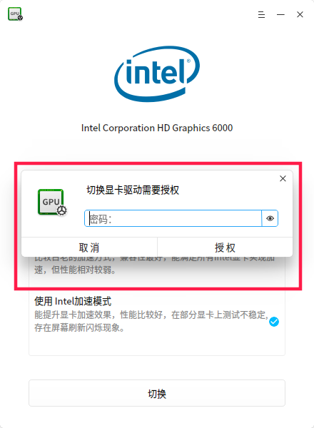

# `Linux` 授权弹窗 `polkit`

在开发Linux桌面软件的时候，我们有时候需要用其他用户的身份执行一些操作，通常是 `root` 用户。

## 方法一：sudo命令

终端执行 `echo "passwd" | sudo -S gedit`
`sudo` 命令的 `-S` 选项是从标准输出流读取密码，使用这种方法没有交互，可以直接提升权限。如果将这条命令写到脚本里，密码需要明文，是不安全的做法，不过简单有效。

## 方法二：polkit

如图所示：

这种弹窗是经常见到的吧，这个是怎么调用出来的呢？

常见的 `Linux` 发行版都有 `polkit` 模块，`Deepin` 也开发了一套，`dde-polkit-agent` 号称是遵守 `freedesktop` 规范的。
我们只要配置好规则文件然后在终端执行：
`pkexec <可执行文件>`
就可以看到这个授权窗口了

### 1. 配置文件

以 `Deepin` 的 `/usr/share/polkit-1/actions/com.deepin.pkexec.dde-file-manager.policy`文件为例

``` xml
<?xml version="1.0" encoding="UTF-8"?>
<!DOCTYPE policyconfig PUBLIC
 "-//freedesktop//DTD PolicyKit Policy Configuration 1.0//EN"
 "http://www.freedesktop.org/standards/PolicyKit/1/policyconfig.dtd">
<policyconfig>
  <vendor>Deepin</vendor>
  <vendor_url>https://www.deepin.com</vendor_url>
  <!-- 权限ID，这个必须唯一 -->
  <action id="com.deepin.pkexec.dde-file-manager">
    <!-- 图标 这个我不知道存在哪里，再研究研究-->
    <icon_name>folder</icon_name>
    <!-- 弹窗提示 -->
    <message>Authentication is required to run the Deepin File Manager</message>
    <defaults>
      <allow_any>no</allow_any>
      <allow_inactive>no</allow_inactive>
      <allow_active>auth_admin_keep</allow_active>
      <!-- 这个defaults节点下的所有子节点可以有这些值no,yes,auth_self,auth_admin,auth_self_keep,auth_admin_keep　-->
    </defaults>
    <!-- 语言为简体中文时的弹窗提示 -->
    <message xml:lang="zh_CN">查看文件夹需要输入密码</message>
    <!-- 权限提升的可执行文件，需是二进制文件 -->
    <annotate key="org.freedesktop.policykit.exec.path">/usr/bin/dde-file-manager</annotate>
    <!-- 这行听说是是否允许GUI，但是测试的时候好像不起作用 -->
    <annotate key="org.freedesktop.policykit.exec.allow_gui">true</annotate>
  </action>
</policyconfig>
```

只需要根据你的需要创建一份这样的文件（以 `policy` 为扩展名），然后保存到 `/usr/share/polkit-1/action` 这个目录下。
可以执行 `pkaction` 查看现有的 `policy`

### 2. 调出弹窗

在终端执行
`pkexec [二进制可执行文件]`
当然，根据上述配置文件，应该是
```pkexec /usr/bin/dde-file-manager```

### Tips

 如果要给脚本提权怎么办呢，我们就需要借助一个 `bash` 解释器——它是一个二进制的可执行文件，我们选用 `/bin/bash` ，先给 `bash` 创建一个 `policy` 文件[ `deepin` 不用创建，已经有了]，然后执行 `pkexec /bin/bash -x <脚本>`
将脚本作为bash的参数【在deepin下执行有个副作用，因为深度显卡驱动管理器的脚本提权用到了bash，所以会显示驱动管理器的图标和提示】

## 参考链接

[freedestop的polkit介绍](https://www.freedesktop.org/software/polkit/docs/latest/polkit.8.html)
[freedesktop的pkexec介绍](https://www.freedesktop.org/software/polkit/docs/latest/pkexec.1.html)
[https://segmentfault.com/a/1190000008063961](https://segmentfault.com/a/1190000008063961)
