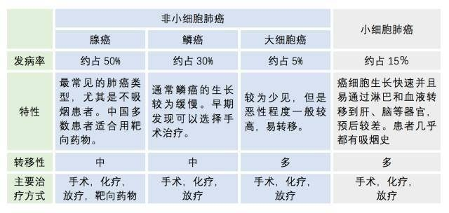

分期则是对某种类型的疾病发展阶段的描述

## 常见的分型

上图的统计数据没有说明来源

- 腺癌：包含很多亚型如腺泡状腺癌、乳头状腺癌、细支气管肺泡癌（BAC）和实性腺癌及多种混合型
- 鳞癌：亚型包含乳头状鳞状细胞癌、透明细胞鳞状细胞癌、小细胞鳞状细胞癌、基底鳞状细胞癌
- 大细胞癌：亚型包含透明细胞大细胞癌、基底细胞样大细胞癌、肺淋巴上皮瘤样癌、肺大细胞神经内分泌癌
- 小细胞肺癌：分型也在积极推进中

> 本节参考自知乎：[https://zhuanlan.zhihu.com/p/27825859](https://zhuanlan.zhihu.com/p/27825859)

## 参考资料

- [https://www.ncbi.nlm.nih.gov/pmc/articles/PMC6015197/](https://www.ncbi.nlm.nih.gov/pmc/articles/PMC6015197/)
- 病理分型：[http://cancer.39.net/aslk/181119/6656795.html](http://cancer.39.net/aslk/181119/6656795.html)
- [WHO 2015分类](./WHO-cancer-classification-2015.pdf)
- [中国肺癌杂志](http://www.lungca.org)
