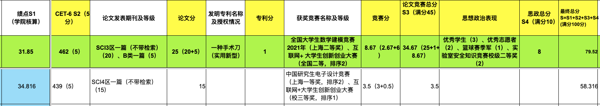
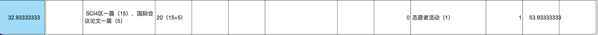

时间荏苒，没想到快乐的研一生活这么快就过去了，我的高压研二上半年也过去了。学校也开始了研究生第二阶段奖学金的评定，作为班委团队的一员，当然是要给同学们整理和审核评奖材料的。

3月5号 星期六 下午五点半，班委们在卓越楼的1104开始审核各种材料，由于我对各种奖项的记分规则并不了解，所以分配了绩点计算的工作，就是通过“成绩总表”分别算出150个同学的绩点，然后填入到一个“在线表格”中，大约花了两个小时。四个人弄到了晚上十点多，呼～，还是有点累。当晚就出具了一份粗略的排名表，恭喜大家一年的辛勤努力得到了一些肯定！！！

> 奖学金积分 = 绩点积分 + 六级积分 + 论文、专利和竞赛积分 + 思想政治

3月6号对奖学金积分计算结果通过“在线表格”进行了公示，3月7号 星期一 我在公司搬砖。当天下午四点多的时候，看到班委群里说有同学发现绩点算错了。于是重新去“成绩总表”查了一下，确实是算错了。
> 由于这个同学有一门课叫“肌骨生物力学建模”，因为课程成绩给的是等级，所以成绩总表里无法通过姓名直接查到成绩。需要手动将 excel 表格里的等级转化为分值，当时已经想不出来是什么原因导致的计算错误了，我就觉得是自己手滑，复制错位置了。吓得我去检查了一下有“肌骨生物力学建模”课程的同学的绩点，检查了其中两个同学的分数没有问题。我竟然天真地以为肯定是自己手滑，就只算错了这一个同学，当时在公司手头上也有一些事情，就妄想不用重新核算了。在班委群里发出了“不用重新算了”、“我不想😂，我觉得没问题” 文字，且看后面怎么打脸。

其他班委同学感到不放心，提议还是再算一次（我内心是拒绝的，但是想想稳妥起见，大家再重新核算一下也好），我就录了两段算绩点的视频。自从发现了第一个同学的绩点算错了，我就不敢再改“在线表格”了，就看着其他班委来核对。

最后核对下来，绩点算错了的有5个，其中4个有“肌骨生物力学模型”，哎呀，真是啪啪打脸！！！当时真的是羞愧至极。。。想找个缝钻进去

到了晚上六点多的时候，大家都核对完了。我痛定思痛，决定再核算一遍，由于先前的操作经验，对成绩总表的结构还是比较熟悉了，不过还是不会弄那个数据透视表。这次吸取了教训，没有再使用手工的方式来计算，而是先将 excel 另存为 csv 格式，然后写了个简单的程序（其实最开始就有这个想法，但是看着大家都在焦急地审核材料，我在旁边开始写代码，着实有点不合适，所以就没有实施）。最后算出来的结果和大家核对出来的结果误差控制在 0.001 分（有挂科记录的同学除外）。呼～，绩点这一块终于放心了！！！

为了弥补我的过错和减轻后期更正积分的工作量，我决定对在“在线表格”做一个自动计算工具。吐槽一下，这个“在线表格”真的设计得太难用了。。。更可恶的是还不敢改
<!-- 因为班长不让，毕竟这表是辅导员设计的，emmm -->


你说在 excel 中 `3.5(3+3.5)` 这种字符串怎么转化为数值 3.5， ~~你可别讲正则匹配了~~。这样形式的表格给成绩汇总带来了很大的不便。

## 反思

TODO 人在做重复的事情时不如计算机可靠
还是要本着对他人负责的态度做事
感谢同学们的包容
敢于提意见

## 计算绩点的代码

``` python
class Record:
    def __init__(self, record_str: str) -> None:
        column = record_str.split(',')
        self.student_id = column[2]
        self.student_name = column[3]
        if column[21] == '缺考':
            self.score = 0
        else:
           self.score = float(column[21])
        self.weight = float(column[38])
    
    def __str__(self) -> str:
        return f'{self.student_id}, {self.student_name}, {self.score}, {self.weight}'

records = []
with open('2020电子信息成绩表.csv') as f:
    f.readline()
    line_num = 0
    while True:
        line = f.readline()
        if not line:
            break
        record = Record(line)
        records.append(record)
        # print(record)
        line_num += 1
# print(line_num)

# students = ['203592604']
students = []
with open('电子信息2020级学生名单.csv') as f:
    f.readline()
    while True:
        line = f.readline()
        if not line:
            break
        columns = line.split(',')
        # print(columns)
        students.append(columns[2])

for student in students:
    total_weight = 0
    sum_score = 0
    for record in records:
        record: Record
        if record.student_id == student:
            sum_score += record.score * record.weight
            total_weight += record.weight
            student_record = record
    gpa = sum_score / total_weight * 0.4
    print(f'{student_record.student_id}, {student_record.student_name}, {gpa}')
```
