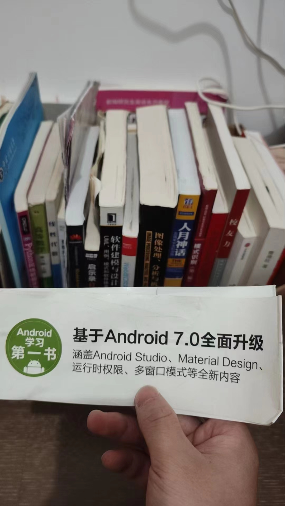

今天收拾东西的时候翻到了《第一行代码》的护封。这个弃之可惜的护封把我的思绪拉回到2017年，还记得这本书还是上安卓开发选修课的时候买的，不久之后，2017年5月，谷歌宣布 Kotlin 成为安卓官方编程语言。那时候的我热衷于学习各种新的编程语言，因为《第一行代码》这本书用的基本上是 Java，我就很少翻这本书了。

到现在我还记忆深刻：任课老师叫刘佰龙，这个选修课的考试是开卷的，考试时间正好和本专业的一堂课冲突了，以至于我只想着去上课，都忘了还有一门考试了。任课老师给我打电话说：
> 『许自强，你怎么没来考试？』

我愣了一下，然后赶紧向考场飞奔。（因为我先前给老师发过一条请假的短信，所以老师有我的号码。可能是那个老师因为我向他请教了一些问题，所以对我有点印象吧）。矿大有很浓的创业氛围，当时参加了一个创业项目--宿舍打印店，帮同学打印文件其实挺烦人的，要手动接收文件，有时候还要沟通特别的打印参数。所以一直想弄一个可以实现远程自助打印的软件系统，在这个过程中请教了刘佰龙老师，他很诚恳地表示并不了解相关技术，并顺势建议我关注一下打印智能报表相关的项目，哈哈哈，他说这个最近挺火的。最后那个打印系统只做了个非常粗糙的demo，还记得当第一份文件自动从打印机输出的时候，我激动了好久😆。

到考场后，发现参考书也没带😭，本来是要去上别的课的呀，监考老师也特别好，还帮我借了书🙏。矿大带给我太多感动了，师恩难忘。祝这两位老师身体健康，工作顺利！
