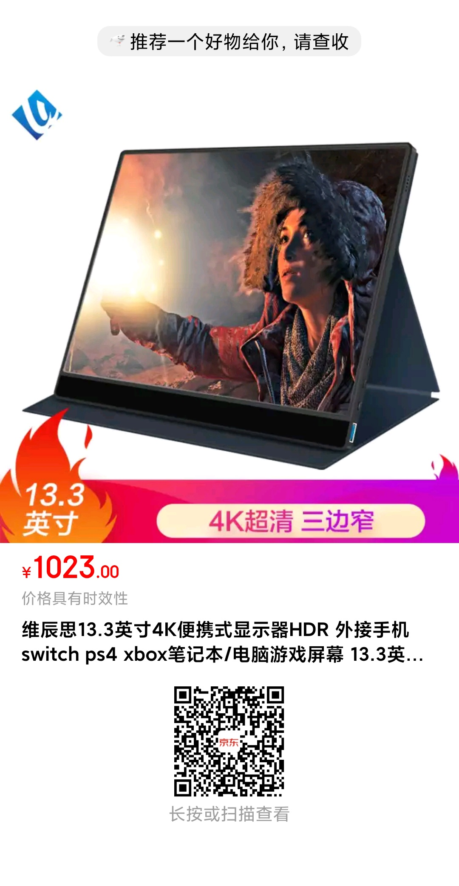
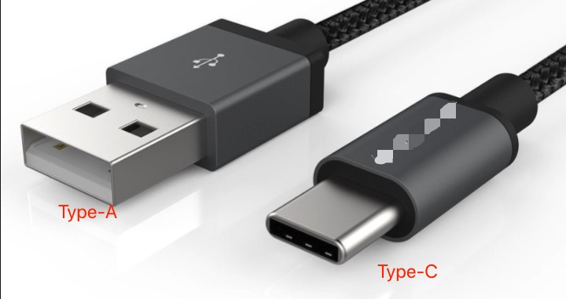

# 给电脑安装一个扩展触摸屏

在使用电脑的过程中，我们经常会感觉一个屏幕不够用。特别是在需要同时观察多个应用的时候。

- 如果你有两块屏幕，想想在使用一个不熟悉的软件，需要看它的操作手册，这时候你可以左边屏幕显示手册，右边屏幕显示这个不熟悉的软件。
- 如果你有两块屏幕，你甚至可以左边屏幕开着视频网站，右边屏幕显示《高等数学》。
- 如果你有两块屏幕，你可以左边显示参考资料，右边写你的论文
- 反正用过的都说好！

> 程序员朋友肯定是深有体会：调试代码、面向搜索引擎编程......，只有一块小小的屏幕可真的有点不方便

但是，一个显示器不是很笨重吗？在这里，给笔记本电脑用户们推荐一款便携式的屏幕：

## 使用触控功能

一年前买了个我就买了这款便携式触控显示器（带电池的，也可以一直插电源用）。它支持 `Type-C` 和 `HDMI` 两种接口。

- 某些 `Type-C` 接口可以同时传输视频信号和触控信号（`USB` 线两端都得是 `Type-C`）
- `HDMI`可以传输视频信号，不能传输触控信号

如果可以使用触控功能：你又是一个 `Windows 10` 用户, 那岂不是可以 `DIY` 一个带小尾巴的 `Surface` 设备了？

### 方法一：仅使用 `USB` 连接线

买显示器的时候送了一条两端都是 `Type-C` 接口的 `USB` 数据线

如果你的电脑有 `Type-C` 的接口，那多半是支持 `Type-C` 视频输出，只用一条两头都是 `Type-C` 接口的 `USB` 线就可以了。

> 现在不少新款电脑都带了 `Type-C` 接口，像小米、华为、苹果的笔记本。

### 方法二：`HDMI` + `USB` 配合使用

因为我的电脑没有 `Type-C` 接口，这一年我都只是把它当做一个普通显示器使用。为此，曾几度想要买个华为手机来试试这显示器的触控功能（华为有几款手机支持外接显示器），奈何比较贫穷，遂作罢。

> 我们知道: `Type-C` 是一种新型的 `USB` 接口，本质上这根传输线还是 `USB` 数据线嘛

最近灵光一闪，我如果用分别用 `HDMI` 线和 `USB` 线来传输视频信号和触控信号行不行呢？
> 而且这根 `USB` 线不一定非得两端都是 `Type-C`接口啊，咱的手机数据线也是 `USB` 线啊(一头 `Type-C`，一头 `Type-A`应该也行吧)

我准备好两条线：

- `HDMI`: 传输视频信号
- 手机数据线（一端 `Type-C`，一端 `Type-A`）: 传输触控信号

果然可以，实际测试: `Windows 10` 和 `Deepin`（其它 `Linux` 应该也可以）使用起来非常完美。目前 `macOS` 暂不支持触控哦

> `Deepin V20` 对触控的支持相对于之前的版本有较大的改善

## 当你有了触摸屏

你就可以愉快地使用 `OneNote` 这类在触摸屏上才好用的软件了。还有，没想到[网页版的 `OneNote`](https://www.onenote.com/)也非常的流畅啊，看来 `Linux` 用户有福了。

## 扩展阅读

- [`USB` 维基百科](https://zh.wikipedia.org/wiki/USB#%E6%8A%80%E6%9C%AF%E6%8C%87%E6%A0%87)
- [一个很多 `USB` 资料的网站](https://www.lifewire.com/universal-serial-bus-usb-2626039)

**USB 接口图**

## 小结

这篇博客没有什么技术含量，花费了不少时间，但是我太想把这个好东西和使用技巧分享给大家了。不过还好，也不是完全没有收获，在这过程中学习了不少 `USB` 的知识。要是我有个助理就好了，我告诉它这个事情，它就可以自动帮我写出这篇文章了，希望有生之年可以看到人工智能可以达到这样的水平。
